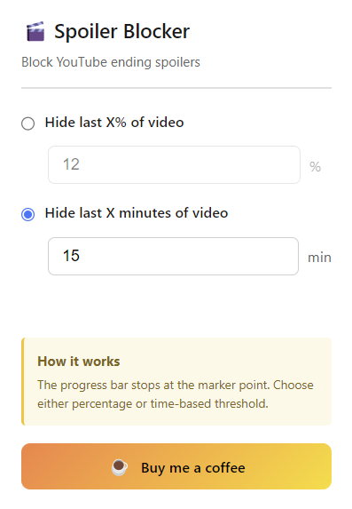
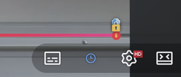

# 🎬 YouTube Spoiler Blocker

A Chrome extension that blocks video progress spoilers on YouTube by limiting how much of the progress bar is visible.

## Features

- **Hide video ending**: Blocks the progress bar from revealing how much time is left in a video
- **Two threshold modes**:
  - **Percentage-based**: Hide the last X% of the video (e.g., last 30%)
  - **Time-based**: Hide the last X minutes of the video (e.g., last 10 minutes)
- **Visual marker**: Shows where the blocking starts with a 🔒 marker on the progress bar
- **Real-time updates**: Settings changes apply immediately without page refresh
- **Auto-save**: Settings are automatically saved as you change them
- **Chapter support**: Works with videos that have multiple chapters

## Installation

1. Clone or download this repository
2. Open Chrome and go to `chrome://extensions/`
3. Enable "Developer mode" (top right toggle)
4. Click "Load unpacked" and select the extension folder
5. The extension icon will appear in your toolbar

## Usage

### Popup Settings

Click the extension icon in your browser toolbar to open the settings popup:



- **Percentage mode**: Hide the last X% of the video
- **Time mode**: Hide the last X minutes of the video
- Settings are **auto-saved** as you change them

### Player Controls

On the YouTube video player, you can toggle the extension on/off using the clock button in the control bar:



- **Blue icon**: Extension is ON
- **White icon**: Extension is OFF

### Lock Marker (🔒)

The lock marker on the progress bar indicates where the spoiler blocking begins:


- Everything **after** the 🔒 marker is hidden
- The progress bar, buffer indicator, and scrubber will not go past this point

## How It Works

### YouTube Progress Bar Structure

YouTube's video player uses a complex DOM structure for the progress bar. This extension intercepts and modifies the following elements:

```
.ytp-progress-bar
├── .ytp-chapters-container
│   └── .ytp-chapter-hover-container (one per chapter)
│       └── .ytp-progress-list
│           ├── .ytp-play-progress      ← Red played portion (scaleX controlled)
│           ├── .ytp-load-progress      ← Gray buffered portion (scaleX controlled)
│           └── .ytp-hover-progress     ← Light hover indicator (scaleX controlled)
└── .ytp-scrubber-container             ← Draggable red dot (translateX controlled)
```

### Technical Implementation

#### 1. Progress Bar Control (scaleX)

YouTube uses CSS `transform: scaleX(value)` to show progress, where:
- `scaleX(0)` = 0% filled
- `scaleX(1)` = 100% filled

This extension uses a **MutationObserver** to watch for style changes on progress elements and enforces a maximum `scaleX` value:

```javascript
// For chapters BEFORE the clip point: no restriction
// For the chapter AT the clip point: maxScaleX = (clipTime - chapterStart) / chapterDuration
// For chapters AFTER the clip point: scaleX(0)
```

#### 2. Scrubber Control (translateX)

The red dot (scrubber) position is controlled via `transform: translateX(Xpx)`. The extension limits its maximum position to the clip point.

#### 3. Chapter Handling

Videos with chapters have multiple `.ytp-chapter-hover-container` elements. The extension:
1. Calculates each chapter's time range based on its width relative to total progress bar width
2. Determines which chapters are before, at, or after the clip point
3. Applies appropriate restrictions to each chapter independently

#### 4. Duration Hiding

The video duration display is hidden via CSS:
```css
.ytp-time-duration,
.ytp-time-separator {
  opacity: 0 !important;
}
```

### Key Files

| File | Description |
|------|-------------|
| `manifest.json` | Extension configuration and permissions |
| `content.js` | Main logic - injects into YouTube pages |
| `popup.html` | Settings UI |
| `popup.js` | Settings handling and messaging |
| `styles.css` | Additional styles |

## Settings

| Setting | Description | Default |
|---------|-------------|---------|
| Threshold Mode | Choose between percentage or time-based hiding | Percentage |
| Percentage | Hide last X% of video | 30% |
| Time | Hide last X minutes of video | 10 min |

## Message Passing

The extension uses Chrome's messaging API to communicate between popup and content script:

```javascript
// Popup → Content Script
chrome.tabs.sendMessage(tabId, {
  type: 'SETTINGS_UPDATED',
  settings: { thresholdMode, percentageThreshold, timeThreshold, enabled }
});

// Content Script receives and applies changes without page reload
chrome.runtime.onMessage.addListener((message) => {
  if (message.type === 'SETTINGS_UPDATED') {
    // Update settings and reapply
  }
});
```

## Browser Support

- Chrome (Manifest V3)
- Edge (Chromium-based)

## Known Limitations

1. The extension relies on YouTube's DOM structure. If YouTube changes their player significantly, updates may be needed.
2. For videos without chapters, the entire progress bar is treated as one segment.
3. Live streams are not supported (no defined duration).

## Development

### Debug Logging

The extension logs its actions to the browser console with the prefix `[Spoiler Blocker]`:

```
[Spoiler Blocker] New video detected
[Spoiler Blocker] Video ready, duration: 1660.861s
[Spoiler Blocker] Progress bar ready, width: 538px, chapters: 10
[Spoiler Blocker] Duration: 1660.861s, Clip Point: 1060.861s (63.9%)
[Spoiler Blocker] Chapter 0: 0.0s - 35.0s, maxScaleX: 1.000, after: false, before: true
...
[Spoiler Blocker] Setup completed
```

### Testing

1. Open a YouTube video with chapters
2. Open browser DevTools (F12)
3. Watch the console for `[Spoiler Blocker]` logs
4. Verify the progress bar stops at the marker point

## License

MIT License

## Support

☕ [Buy me a coffee](https://buymeacoffee.com/codingcat)
